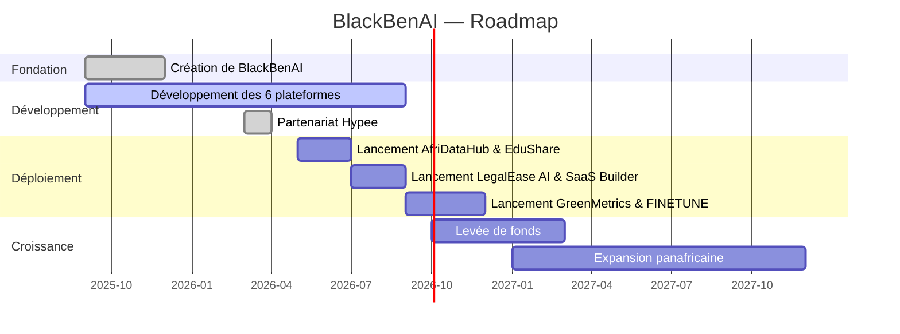

# Wrote README.md
<div align="center">
  
  <br/><br/>
  <!-- Badges -->
  <a href="https://blackbenai.com"></a>
  <a href="https://www.linkedin.com/company/blackbenai"></a>
  <a href="mailto:contact@blackbenai.com"></a>
  <a href="https://wa.me/2290159037170"></a>
  <br/>
  <!-- Tagline -->
  <h1>
    <em>L'Intelligence Artificielle au service de l'Afrique</em>
  </h1>
  <p>
    <strong>BlackBenAI</strong> est une startup béninoise qui conçoit, développe et opère <strong>six plateformes SaaS</strong> d'intelligence artificielle souveraines, enracinées dans les réalités africaines.
  </p>
  <br/>
  <!-- Quick stats -->
  <table>
    <tr>
      <td align="center"><strong>🚀</strong></td>
      <td><strong>6</strong> Plateformes SaaS</td>
      <td align="center"><strong>📍</strong></td>
      <td><strong>Cotonou, Bénin</strong></td>
    </tr>
    <tr>
      <td align="center"><strong>📅</strong></td>
      <td>Fondation <strong>2025</strong></td>
      <td align="center"><strong>👥</strong></td>
      <td><strong>2</strong> Fondateurs</td>
    </tr>
  </table>
</div>
<br/>
---
## 📋 Table des matières
- [Notre Mission](#-notre-mission)
- [Nos Plateformes](#-nos-plateformes)
- [Technologies](#-technologies)
- [L'Équipe](#-léquipe)
- [Roadmap](#-roadmap)
- [Nous Rejoindre](#-nous-rejoindre)
- [Contact](#-contact)
---
## 🎯 Notre Mission
> **Faire de l'Afrique un producteur d'intelligence artificielle de classe mondiale, et non plus un simple consommateur de technologies importées.**
BlackBenAI crée des solutions IA souveraines, performantes et accessibles, conçues **par des Africains** pour répondre aux défis spécifiques du continent — éducation, agriculture, justice, données, développement logiciel.
| Pilier | Valeur |
|--------|--------|
| 🌍 **IA Africaine** | Des solutions conçues par des Africains, pour les Africains |
| 🛡️ **Souveraineté** | Maîtrise de nos données, algorithmes et infrastructure |
| ⚡ **Innovation ouverte** | APIs documentées, standards ouverts, écosystème collaboratif |
| 🌱 **Impact continental** | Chaque plateforme résout un défi réel à l'échelle de l'Afrique |
---
## 🚀 Nos Plateformes
<div align="center">
  <table>
    <tr>
      <td width="33%" align="center">
        <br/>
        
        <br/>
        <h3>⚖️ LegalEase AI</h3>
        <p><em>Analyse juridique assistée par IA</em></p>
        <p align="left">
          Plateforme d'analyse et de rédaction juridique intelligente. 
          Automatisez la recherche de jurisprudence, la rédaction de contrats 
          et l'analyse de documents légaux.
        </p>
        <p><strong>Tech :</strong> NLP, LLM, RAG, Django</p>
      </td>
      <td width="33%" align="center">
        <br/>
        
        <br/>
        <h3>🌾 GreenMetrics</h3>
        <p><em>Agri-Tech & optimisation des cultures</em></p>
        <p align="left">
          Solution Agri-Tech pilotée par l'IA pour l'optimisation des 
          rendements agricoles, la détection précoce des maladies 
          et la gestion intelligente des ressources.
        </p>
        <p><strong>Tech :</strong> Computer Vision, IoT, TensorFlow</p>
      </td>
      <td width="33%" align="center">
        <br/>
        
        <br/>
        <h3>⚙️ FINETUNE AI</h3>
        <p><em>Fine-tuning de LLMs pour l'Afrique</em></p>
        <p align="left">
          Plateforme de fine-tuning de modèles de langage (LLMs) 
          adaptés aux langues africaines, contextes culturels 
          et besoins spécifiques du continent.
        </p>
        <p><strong>Tech :</strong> PyTorch, HuggingFace, LoRA</p>
      </td>
    </tr>
    <tr>
      <td width="33%" align="center">
        <br/>
        
        <br/>
        <h3>📚 EduShare</h3>
        <p><em>Plateforme éducative augmentée</em></p>
        <p align="left">
          La plus grande base de données éducative collaborative d'Afrique. 
          Contenus multilingues, cours interactifs et apprentissage 
          augmenté par l'IA.
        </p>
        <p><strong>Tech :</strong> React, AI Tutoring, RAG</p>
      </td>
      <td width="33%" align="center">
        <br/>
        
        <br/>
        <h3>🏗️ SaaS Builder</h3>
        <p><em>Ingénierie logicielle agentique</em></p>
        <p align="left">
          Générateur de SaaS intelligent : décrivez votre projet, 
          l'IA génère l'architecture, le code, le déploiement 
          et la documentation.
        </p>
        <p><strong>Tech :</strong> AI Agents, CodeGen, DevOps</p>
      </td>
      <td width="33%" align="center">
        <br/>
        
        <br/>
        <h3>🗄️ AfriDataHub</h3>
        <p><em>Intelligence de données africaines</em></p>
        <p align="left">
          Plateforme centralisée d'intelligence de données : collecte, 
          analyse, visualisation et valorisation des données africaines 
          pour les entreprises et institutions.
        </p>
        <p><strong>Tech :</strong> Big Data, ETL, Dashboards</p>
      </td>
    </tr>
  </table>
</div>
---
## 🛠️ Technologies
<div align="center">
| Domaine | Technologies |
|---------|--------------|
| **Frontend** |     |
| **Backend** |    |
| **IA / ML** |    |
| **DevOps** |    |
</div>
---
## 👥 L'Équipe
<div align="center">
  <table>
    <tr>
      <td align="center" width="50%">
        
        <br/>
        <h3>Mahouli Marino ATOHOUN</h3>
        <p><strong>Cofondateur & PDG</strong></p>
        <p><em>Développement & Architecture</em></p>
        <p>
          <a href="https://www.linkedin.com/in/marino-atohoun/">
            
          </a>
        </p>
      </td>
      <td align="center" width="50%">
        
        <br/>
        <h3>Horacio NANI</h3>
        <p><strong>Cofondateur & Conseiller économique</strong></p>
        <p><em>Amélioration & Monétisation</em></p>
        <p>
          <a href="https://www.linkedin.com/in/horacio-nani-4b134718b/">
            
          </a>
        </p>
      </td>
    </tr>
  </table>
</div>
---
## 🗺️ Roadmap

---
## 🤝 Nous Rejoindre
BlackBenAI est en phase d'incubation. Nous ne proposons pas de rémunération immédiate, mais un environnement unique pour **apprendre, créer et construire un portfolio** sur des projets IA réels.
**Profils recherchés :**
- 🧑‍💻 Développeurs Full Stack (React / Node.js / Python)
- 🤖 Ingénieurs IA / Machine Learning / LLM
- 🎨 UI/UX Designers
- 📊 Data Engineers / Scientists
- 🛡️ Experts cybersécurité & conformité (RGPD, AI Act)
- 📣 Community Managers & Content Writers
- 👥 Chargés RH & Business Developers
> 👉 **Postulez ici :** [carrieres@blackbenai.com](mailto:carrieres@blackbenai.com?subject=Candidature%20BlackBenAI)
---
## 📞 Contact
| Canal | Détail |
|-------|--------|
| 🌐 **Site web** | [blackbenai.com](https://blackbenai.com) |
| 📧 **Email** | [contact@blackbenai.com](mailto:contact@blackbenai.com) |
| 💬 **WhatsApp** | [+229 01 59 03 71 70](https://wa.me/2290159037170) |
| 🔗 **LinkedIn** | [linkedin.com/company/blackbenai](https://www.linkedin.com/company/blackbenai) |
| 📍 **Adresse** | Cotonou, Bénin (Afrique de l'Ouest) |
---
<div align="center">
  <p>
    <strong>BlackBenAI</strong> — <em>L'Intelligence Artificielle au service de l'Afrique</em>
  </p>
  <p>
    <a href="https://blackbenai.com"></a>
  </p>
  <p>
    <sub>© 2026 BlackBenAI. Tous droits réservés.</sub>
  </p>
</div>
<br/>
---
### 🛠 Opérations (Serveur — usage interne)
| Environnement | URL | Commande |
|---|---|---|
| Développement | `http://187.77.179.99:8082` | `docker compose up dev -d` |
| Production | `https://blackbenai.com` (port 8082, proxy nginx) | `docker compose up prod -d` |
```bash
cd /root/projects/BlackBenAISite-V2
docker compose up dev -d          # Démarrer le dev
docker compose up prod -d --build # Build & déployer la prod
```
